# Mama Bosa's league call — why it never fired, and the fix

A report on the call added in `103e0a5ce9`, which never fired for any player on any route
through EVER GRANDE CITY, and a frame-by-frame verification of the fixed build running
headless in mGBA.

## Contents

- [The bug](#the-bug)
- [The fix](#the-fix)
- [Verification](#verification)
  - [The old placement, reproduced](#the-old-placement-reproduced)
  - [Walking in from the city](#walking-in-from-the-city)
  - [Coming back out of Victory Road](#coming-back-out-of-victory-road)
  - [Second pass, and the badge gate](#second-pass-and-the-badge-gate)
- [How the headless run was driven](#how-the-headless-run-was-driven)

## The bug

`103e0a5ce9` put the coord trigger at **(18, 28)**. That is one tile south of warp 3, the
upper mouth of VICTORY ROAD — and it is also the only passable tile there:

```
y    x=15 16 17 18 19 20 21 22
27      #  #  #  .  #  #  .  .     <- warp 3, the cave mouth
28      #  #  #  .  .  .  .  .     <- the old trigger
```

Which means (18, 28) is not a tile you walk onto. It is the tile the game *places* you on
when you come out of VICTORY ROAD. A coord event only fires when the player steps onto its
tile under their own power; warping in does not fire it. So on the one route that leads past
it, the trigger was dead.

The placement was wrong on design grounds too. The commit's stated intent was "the whole
climb still ahead and a flight back to LILYCOVE still worth making", but (18, 28) is on the
plateau, *above* VICTORY ROAD. Acting on the advice from there — stock up in LILYCOVE, go
and see the man by the legendary dens — means flying out and re-running the whole of
VICTORY ROAD to get back.

## The fix

The trigger moves to **(18, 43)**, in the neck below the *lower* VICTORY ROAD entrance.

(18, 42) is the obvious candidate and is a genuine one-block chokepoint, but it is the
landing tile of the lower cave warp, so it carries exactly the same latent weakness as the
old tile. (18, 43) is one step further out: no warp lands there, and it is still
unavoidable, because (18, 42) connects only to the cave at 41 and to 43, and 19,43 is the
VICTORY ROAD sign.

```
y    x=15 16 17 18 19 20 21 22
41      #  #  #  .  #  #  #  #     <- warp 2, the cave mouth
42      #  #  #  .  #  #  #  #     <- warp 2 lands you here
43      #  #  .  .  #  .  #  #     <- the trigger
44      .  .  .  .  .  .  .  .
```

That tile also fires in both directions, which the old one could never do: walking in from
the city, *and* walking back out of VICTORY ROAD (you land on 42, then step south onto 43).
So a save that has already been through VICTORY ROAD still gets the call.

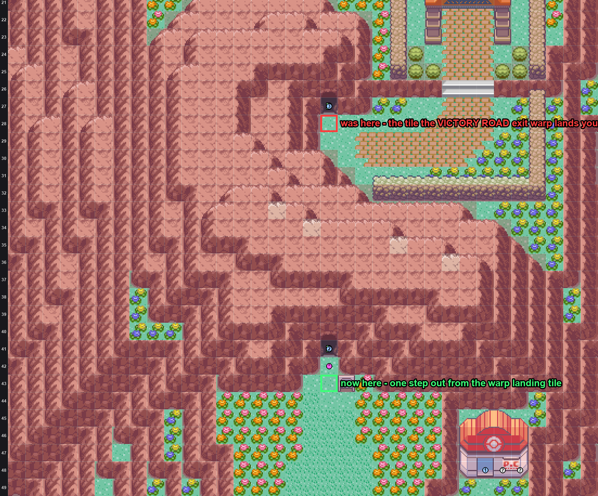

The script is untouched — still gated on `FLAG_BADGE08_GET` as well as its own
`FLAG_MAMA_BOSA_LEAGUE_CALL`, still once per save.

## Verification

Built from the working tree, run headless through `libmgba`. The player is placed on the
map with `FLAG_BADGE08_GET` set and walked over the tile. Screenshots are raw framebuffer
dumps at 2×, so they are exactly what the GBA drew. Positions are read out of
`gSaveBlock1Ptr->pos` rather than eyeballed.

### The old placement, reproduced

Arriving exactly as you do when you leave VICTORY ROAD at the top. The player is placed on
(18, 28) — the old trigger tile — and nothing happens:

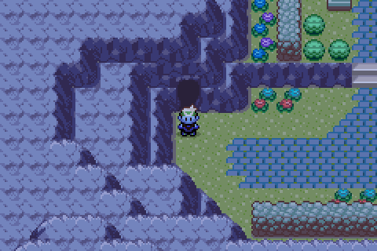

Walking on across the plateau toward the league, still nothing:

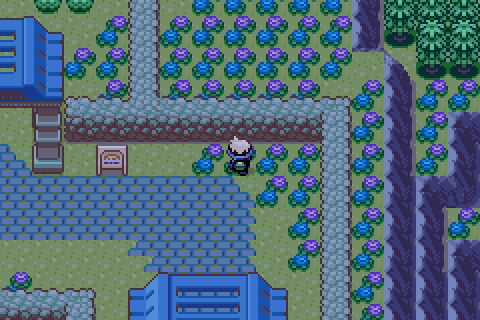

### Walking in from the city

New placement. Walking north from (18, 47), the call fires on the step onto (18, 43):

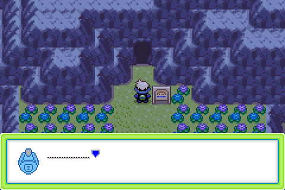
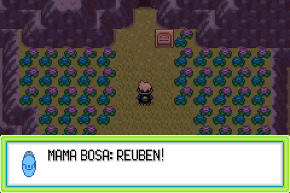
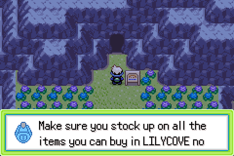
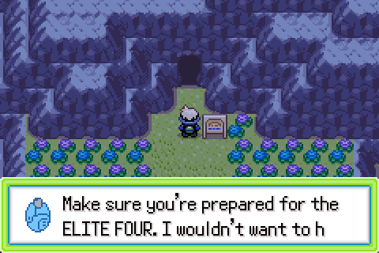
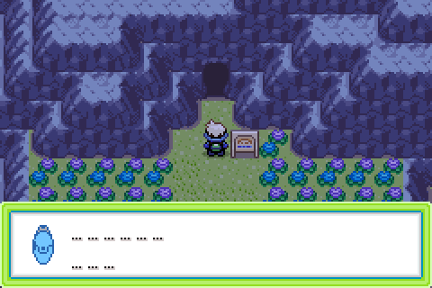

The window closes, `releaseall` runs, control returns:

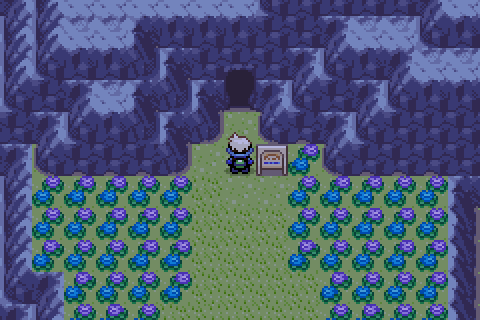

Note the window animates shut *before* the script's `waitbuttonpress` is satisfied, so there
is a short stretch where the field looks normal but the player is still locked. That is
vanilla `pokenavcall` behaviour and matches every other call in the game, but it looks
exactly like a freeze and cost time during this investigation.

### Coming back out of Victory Road

This one is walked end to end rather than warped into place, because "does the cave put you
straight onto the trigger tile?" is precisely the question the old placement got wrong, and
a debug warp is not proof about a real one.

The player is placed inside VICTORY ROAD 1F on its warp 0 at (15, 40) — the real exit, whose
`dest_warp_id` is EVER GRANDE CITY's warp 2 — and walks out under their own power. They land
on **(18, 42)**, map banner still up, no call:

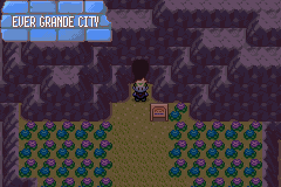

One step south onto (18, 43) fires it:

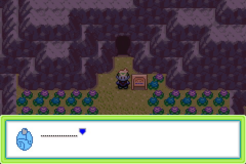

So the warp exit and the trigger are on different tiles, which is the whole point of
choosing 43 over 42.

### Second pass, and the badge gate

Walking off the tile and back on after the call, position confirmed at (18, 43). No call —
`FLAG_MAMA_BOSA_LEAGUE_CALL` holds:

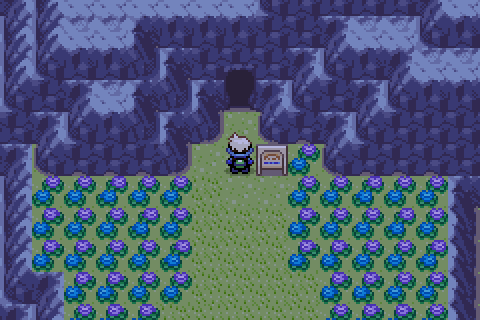

The same walk on a build that does not set `FLAG_BADGE08_GET`. The player is not stopped at
all; they carry straight on through 43, 42 and 41 and into VICTORY ROAD 1F:

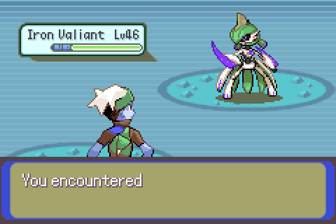

## How the headless run was driven

`dev_scripts/gba_shot/driver.c` gained two argument forms for this, both useful for any
future field-script check:

| Argument | Meaning |
|---|---|
| `H:<from>:<to>:<keymask>` | hold keys across a frame range, instead of one argument per frame |
| `P:<frame>` | print the player's map coordinates, read from `gSaveBlock1Ptr->pos` |

The range-hold matters for more than brevity: building the old per-frame argument list for a
several-hundred-frame walk produced argument lists long enough that presses were silently
dropped, which looks identical to the player being blocked by collision, and sent this
investigation chasing an elevation bug that did not exist.

The player was placed on the map by a temporary `CB2_DebugWarp` wired in through
`ld_script_modern.ld`'s `gInitialMainCB2`, doing the save-block and heap setup that
`CB2_InitCopyrightScreenAfterBootup` normally does, then `NewGameInitData`, a warp
destination and `CB2_LoadMap`. That file was removed and the linker script restored after
the run; only the map fix and the driver arguments remain.
