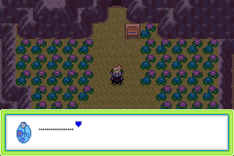
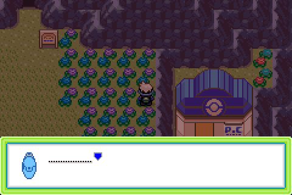

# Mama Bosa's league call — why it never fired, and the fix

A report on the call added in `103e0a5ce9`, which never fired for any player on any route
through EVER GRANDE CITY, and a frame-by-frame verification of the fixed build running
headless in mGBA.

## Contents

- [The bug](#the-bug)
- [The fix](#the-fix)
- [Verification](#verification)
  - [The old placement, reproduced](#the-old-placement-reproduced)
  - [Walking in from the city](#walking-in-from-the-city)
  - [Coming back out of Victory Road](#coming-back-out-of-victory-road)
  - [Arriving from the Pokémon Center](#arriving-from-the-pokémon-center)
  - [Second pass, and the badge gate](#second-pass-and-the-badge-gate)
- [How the headless run was driven](#how-the-headless-run-was-driven)

## The bug

`103e0a5ce9` put the coord trigger at **(18, 28)**. That is one tile south of warp 3, the
upper mouth of VICTORY ROAD — and it is also the only passable tile there:

```
y    x=15 16 17 18 19 20 21 22
27      #  #  #  .  #  #  .  .     <- warp 3, the cave mouth
28      #  #  #  .  .  .  .  .     <- the old trigger
```

Which means (18, 28) is not a tile you walk onto. It is the tile the game *places* you on
when you come out of VICTORY ROAD. A coord event only fires when the player steps onto its
tile under their own power; warping in does not fire it. So on the one route that leads past
it, the trigger was dead.

The placement was wrong on design grounds too. The commit's stated intent was "the whole
climb still ahead and a flight back to LILYCOVE still worth making", but (18, 28) is on the
plateau, *above* VICTORY ROAD. Acting on the advice from there — stock up in LILYCOVE, go
and see the man by the legendary dens — means flying out and re-running the whole of
VICTORY ROAD to get back.

## The fix

The trigger becomes a **row of 13 coord events at y = 46, x = 12..24** — the full width of
the flower field on the approach to the lower VICTORY ROAD entrance, five steps short of the
cave mouth.

```
y    x=15 16 17 18 19 20 21 22
41      #  #  #  .  #  #  #  #     <- warp 2, the cave mouth
42      #  #  #  .  #  #  #  #     <- warp 2 lands you here
43      #  #  .  .  S  .  #  #     <- S is the VICTORY ROAD sign
44      .  .  .  .  .  .  .  .
45      .  .  .  .  .  .  .  .
46      T  T  T  T  T  T  T  T     <- the trigger row, x=12..24
```

A row rather than a single tile for two reasons. The first is correctness: the tile at the
mouth can never be a trigger, because (18, 42) is where the cave warp *puts* you, and a coord
event only runs when the player steps onto it under their own power. Any design that depends
on one tile at a chokepoint is one map edit away from the original bug. The second is feel —
the user's words were that a single tile at the neck "doesn't feel the most natural". Out on
the open field you get the call with the cave mouth and its sign in shot, walking toward
them, rather than wedged in a one-tile corridor.

Being a row does not weaken the guarantee, because the row is a complete graph cut. Flood
filling the map from the south edge with the row removed reaches nothing north of it:

| row | trigger tiles | tiles north of the row still reachable from the south |
|---|---|---|
| y=43 | 3 (x 17..20) | 0 |
| y=44 | 13 (x 12..24) | 0 |
| **y=46** | **13 (x 12..24)** | **0** |
| y=49 | 15 (x 13..29) | 0 |

Every row from 43 to 49 is a valid cut, so y=46 was chosen on framing alone. All 13 tiles are
elevation 5 and passable (`MB_NORMAL` or `MB_SHORT_GRASS`), and no warp on the map lands on
row 46, so every tile in it is reachable only by stepping.

Firing on any of 13 tiles needs a guard so the row does not re-arm as you walk along it. The
coord events are conditioned on `VAR_TEMP_2 == 0` and the script sets it to 1 on its first
line, so the row fires at most once per visit to the map; `VAR_TEMP_*` clears on every map
load, and `FLAG_MAMA_BOSA_LEAGUE_CALL` still holds it to once per save.


The script body is untouched — still gated on `FLAG_BADGE08_GET` as well as its own
`FLAG_MAMA_BOSA_LEAGUE_CALL`.

## Verification

Built from the working tree, run headless through `libmgba`. The player is placed on the
map with `FLAG_BADGE08_GET` set and walked over the tile. Screenshots are raw framebuffer
dumps at 2×, so they are exactly what the GBA drew. Positions are read out of
`gSaveBlock1Ptr->pos` rather than eyeballed.

### The old placement, reproduced

Arriving exactly as you do when you leave VICTORY ROAD at the top. The player is placed on
(18, 28) — the old trigger tile — and nothing happens:


Walking on across the plateau toward the league, still nothing:


### Walking in from the city

New placement. Walking north from (18, 50), the call fires on the step onto (18, 46), with
the cave mouth and the VICTORY ROAD sign in view ahead:


The window closes, `releaseall` runs, control returns:


Note the window animates shut *before* the script's `waitbuttonpress` is satisfied, so there
is a short stretch where the field looks normal but the player is still locked. That is
vanilla `pokenavcall` behaviour and matches every other call in the game, but it looks
exactly like a freeze and cost time during this investigation.

### Coming back out of Victory Road

This one is walked end to end rather than warped into place, because "does the cave put you
straight onto the trigger tile?" is precisely the question the old placement got wrong, and a
debug warp is not proof about a real one.

The player is placed inside VICTORY ROAD 1F on its warp 0 at (15, 40) — the real exit, whose
`dest_warp_id` is EVER GRANDE CITY's warp 2 — and walks out under their own power, landing on
(18, 42). Four steps south, the row fires:



The exit tile and the trigger row are four rows apart, so no warp landing can swallow the
trigger the way it did the old one.

### Arriving from the Pokémon Center

The other way onto the field. Walking north from (24, 48), by the Pokémon Center, the call
fires on (24, 46) — the east end of the row, twelve tiles from where the middle approach
fires it:



### Second pass, and the badge gate

After the call, walking west along the row from (18, 46) to (12, 46) crosses six more trigger
tiles, then turns north to (12, 44). Silent throughout — the `VAR_TEMP_2` guard holds, so the
row does not stutter:


The same walk on a build that does not set `FLAG_BADGE08_GET`. The player is not stopped at
all; they cross the row, the neck at 43/42 and the cave mouth, ending up at (15, 30) inside
VICTORY ROAD 1F:


## How the headless run was driven

`dev_scripts/gba_shot/driver.c` gained two argument forms for this, both useful for any
future field-script check:

| Argument | Meaning |
|---|---|
| `H:<from>:<to>:<keymask>` | hold keys across a frame range, instead of one argument per frame |
| `P:<frame>` | print the player's map coordinates, read from `gSaveBlock1Ptr->pos` |

The range-hold matters for more than brevity: building the old per-frame argument list for a
several-hundred-frame walk produced argument lists long enough that presses were silently
dropped, which looks identical to the player being blocked by collision, and sent this
investigation chasing an elevation bug that did not exist.

The player was placed on the map by a temporary `CB2_DebugWarp` wired in through
`ld_script_modern.ld`'s `gInitialMainCB2`, doing the save-block and heap setup that
`CB2_InitCopyrightScreenAfterBootup` normally does, then `NewGameInitData`, a warp
destination and `CB2_LoadMap`. That file was removed and the linker script restored after
the run; only the map fix and the driver arguments remain.
