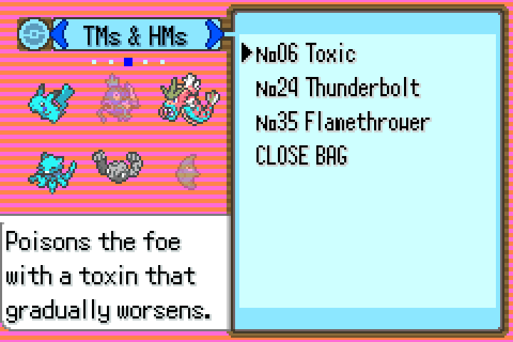
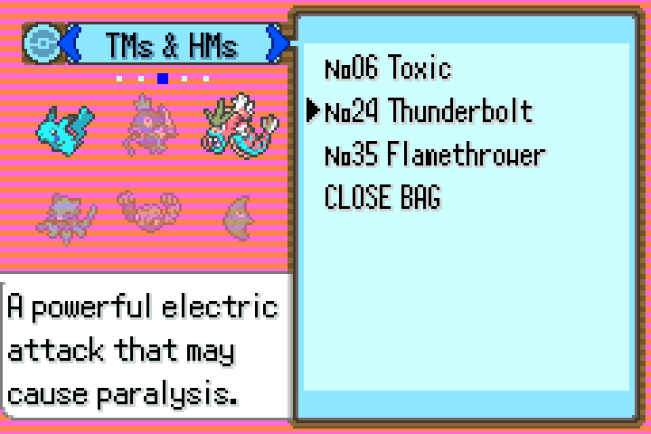
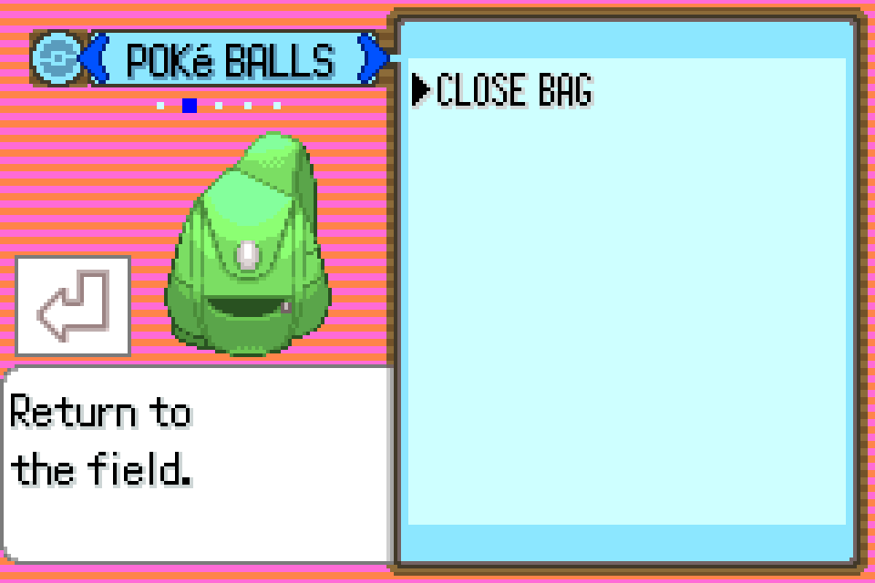

# TM pocket party icons

The TM pocket used to show what every other pocket shows: the bag, and the
selected item's icon in a white panel below it. Neither tells you anything you
can't already see. It now shows the party instead, with the mons that can't
learn the highlighted move faded out, so you can tell whether a TM is worth
opening at all without walking through the teach dialogue to find out.

All screenshots on this page are real frames off the built ROM, captured with
the headless driver in `dev_scripts/gba_shot/` (see [Screenshots](#screenshots)).

## Contents

- [What it looks like](#what-it-looks-like)
- [Where the icons sit](#where-the-icons-sit)
- [How the fade works](#how-the-fade-works)
- [The white panel](#the-white-panel)
- [When it refreshes](#when-it-refreshes)
- [Screenshots](#screenshots)

## What it looks like

TM06 Toxic highlighted. Nearly everything learns Toxic, so only Magikarp
(top middle) and Metapod (bottom right) are faded:

Cursor down one, to TM24 Thunderbolt. Now only Pikachu and Gyarados stay solid:

The party in these shots is a scratch one built by the capture harness, which is
why it reads as vanilla mons.

## Where the icons sit

Three columns by two rows, 32x32 each, in the space the bag sprite had:

| | Column 1 | Column 2 | Column 3 |
|---|---|---|---|
| Row 1 | x 24, y 44 | x 56, y 44 | x 88, y 44 |
| Row 2 | x 24, y 76 | x 56, y 76 | x 88, y 76 |

Those are sprite centres. The grid spans x 8-104, y 28-92, which clears the
pocket name bar and dots above (down to y 27) and the description window below
(from y 104). Three rows of icons would not fit in that 70px of height, which is
why it is 3x2 rather than 2x3.

Slots are filled in party order, and empty ones are simply not created. The bag
sprite is set invisible rather than destroyed, so the pocket-switch animation
still has something to animate.

## How the fade works

`CanLearnTeachableMove(species, move)` decides, with the move read off the
highlighted item via `ItemIdToBattleMoveId`. Eggs and the Cancel row fade
everything.

A mon that fails gets `oam.objMode = ST_OAM_OBJ_BLEND`, which on GBA hardware
makes that one sprite alpha-blend with whatever is behind it. `BLDCNT` names only
the second target (the backgrounds and the backdrop) and `BLDALPHA` is
`BLDALPHA_BLEND(6, 10)` - six sixteenths icon, ten sixteenths background.
Sprites that aren't flagged render untouched.

The obvious-looking alternative, greyscale palettes, does not fit. Six party
mons can span all six mon icon palettes, and duplicating those would exhaust the
bag's OBJ palette slots.

Two hardware details cost an hour each, so they are worth writing down:

- `BLDCNT_TGT1_OBJ` with `BLDCNT_EFFECT_DARKEN` darkens **every** sprite on
  screen, not just the flagged ones. Target 1 for OBJ is a layer-wide bit.
- A sprite whose OAM mode is semi-transparent is forced into alpha blending
  whatever brightness effect `BLDCNT` asks for. With `BLDALPHA` left at 0 the
  flagged icons went nearly black.

So the per-sprite flag and the brightness effect cannot be combined. The flag
plus `BLDALPHA` is the combination that works.

## The white panel

The panel that holds the item icon at the bottom left is BG2 tilemap, not a
sprite, so hiding the TM disc left an empty white box sitting under the
bottom-left mon.

`HideItemIconBox` copies the plain striped tiles from the column beside it
(tile x 8) over the 5x5 tile rect at tile (0, 8), saving the originals in a
static buffer first. `RestoreItemIconBox` writes them back. The stripes differ
row to row, so the source tile is re-read per row rather than filled with one
constant.

Restoring is checked - switching to another pocket brings the panel, the bag
sprite and the item icon all back:

## When it refreshes

| Hook | What happens |
|---|---|
| Bag init, state 15 | Create icons, then tint by hand - the list menu was built at state 14, before the icons existed |
| `BagMenu_MoveCursorCallback` | Re-tint for the newly highlighted TM |
| `SwitchBagPocket` | Tear down, restore the panel and the bag sprite |
| `Task_SwitchBagPocket` case 1 | Build up on arrival, before `ListMenuInit` so its init callback finds the icons |
| `Task_CloseBagMenu` | Tear down, so `BLDCNT` doesn't leak into the next screen |

The whole thing is skipped for Wally's bag, link sessions and an empty party; in
those cases the bag sprite shows as before.

## Screenshots

There is no save to boot into - `pokeemerald.sav` is blank and `pokeemerald.ss1`
predates the current code layout - so the capture harness temporarily points
`InitMainCallbacks` at a CB2 that calls `NewGameInitData()`, creates a party,
adds three TMs and jumps straight to `GoToBagMenu(..., POCKET_TM_HM, ...)`. That
patch is not committed; see `dev_scripts/gba_shot/README.md` for the recipe and
for the two build flags the harness needs.
